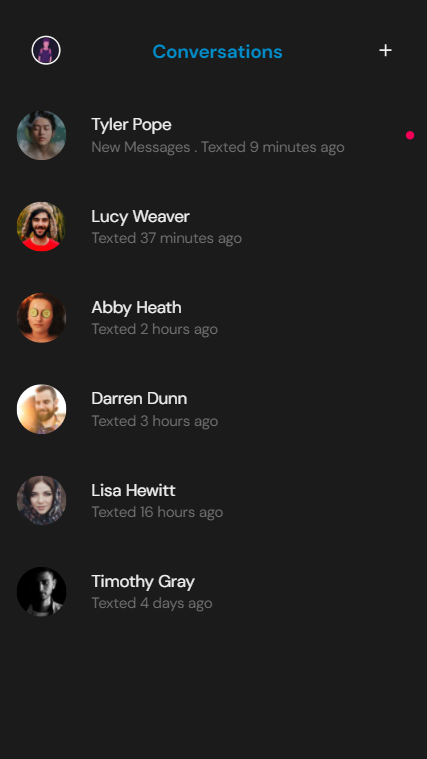
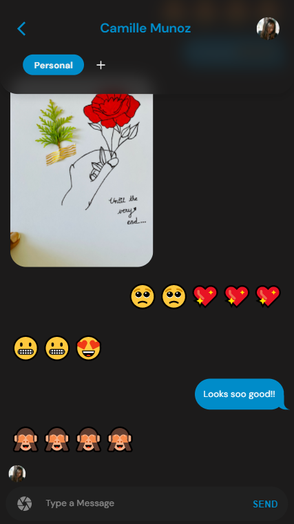

**[live-demo](https://comma-messenger.netlify.app)**

# comma-js-frontend

An open source messenger based on Node.js and React

Conversations             |  Splits
:-------------------------:|:-------------------------:
 | 

**Is this another 'chat' application built based on YouTube examples? NO**

**Ok it's not that, so how does it standout?**
* Integrated Google Single Sign On for one-click user creation and login.💻
* Splits - This means users have the ability have sub conversations inside threads. Think of a conversation like a browser window with multiple tabs open! 💭
* Lock parts of conversations instead of locking the whole application! Each tab in a thread are renamable and password-protectable! 🔐
* Notifications support. 🔔
* Spotify integration to preview song links sent in chat. 🎧

**How to Run?**

* Install all the dependencies by running `npm install`.
* Execute command `npm start`.
* Open http://localhost:3000.
